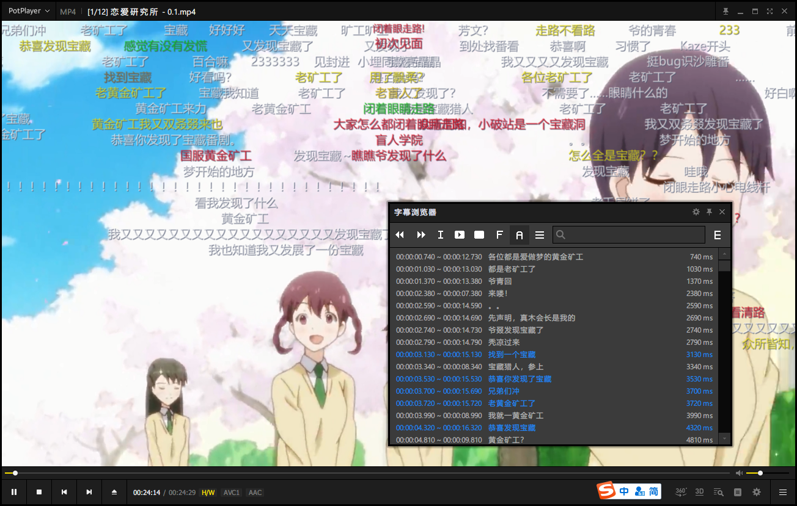

# MobileBiliDownloadVideoConvert

把B站移动端视频转换为MP4文件

主要是用来备份移动端下载了而在线版又被删除了的视频

弹幕样式修改请参考[DanmakuFactory](https://github.com/hihkm/DanmakuFactory)

立项日期：2022年3月15日

---

## 开发环境

Python: 3.9.10

---

## 使用方法

需要指定视频的输入输出目录

暂时只支持Android客户端

把Android目录：/sdcard/Android/data/tv.danmaku.bili/download

整个拷贝到本地目录，然后修改变量`path_download`的值

视频转换需要`ffmpeg`

请修改变量`path_ffmpeg`的值

请指定输出目录`path_output`

---

默认开启弹幕转换

弹幕转换需要[DanmakuFactory](https://github.com/hihkm/DanmakuFactory)

请下载仓库内自带的版本或者自行手动下载并修改变量`path_DanmakuFactory`的值

弹幕转换需要`ffprobe`读取视频分辨率

请修改变量`path_ffprobe`的值

---

# 更新日志

## 0.0.1 `2022-03-20`

`A` 版本发布